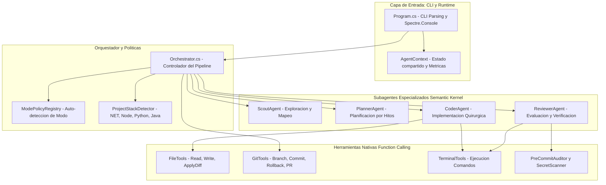
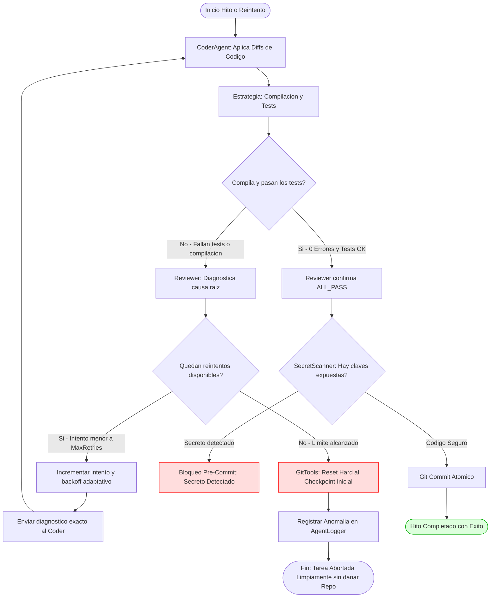

# DevBot — Arquitectura Técnica y Presentación de Proyecto
> **Documento de Defensa Técnica y Explicación Arquitectónica**  
> *Preparado para postulación de equipo técnico (AI Engineer / Backend / Generalista)*

---

## 📌 1. Resumen Ejecutivo (Pitch de 2 Minutos)

**DevBot** es un motor agéntico autónomo desarrollado en **C# / .NET 8** sobre **Microsoft Semantic Kernel** y modelos **Google Gemini**, diseñado para resolver el problema de la automatización del ciclo de desarrollo de software (*Software Development Life Cycle - SDLC*).

A diferencia de un asistente de chat convencional (como Copilot o ChatGPT en ventana de chat), DevBot opera como un **sistema multi-agente orquestado con herramientas reales del sistema operativo**:
- Inspecciona repositorios reales sin importar el lenguaje (detecta .NET, Node/TypeScript, Python, Maven/Java).
- Extrae arquitectura y reglas de estilo (`RepoMap` y `MemoryService`).
- Solicita confirmación humana antes de tocar código (*Human-in-the-loop*).
- Descompone la tarea en hitos secuenciales mediante un agente planificador.
- Ejecuta un ciclo iterativo de codificación y revisión (*Coder ↔ Reviewer Loop*) con compilación y pruebas unitarias reales.
- Realiza auditoría de seguridad pre-commit (bloqueando filtraciones de API keys o credenciales).
- Realiza rollback automático en Git si las pruebas fallan tras agotar los reintentos permitidos.
- Si todo pasa con éxito, genera un commit atómico y prepara el Pull Request en GitHub.

---

## 🏛️ 2. Decisiones Arquitectónicas Clave (El "¿Por qué?")

| Decisión Arquitectónica | Alternativa Descartada | Justificación Técnica |
| :--- | :--- | :--- |
| **Arquitectura Multi-Agente Especializada** (*Scout, Planner, Coder, Reviewer*) | Un único "Mega-Prompt" monolítico | Los LLMs sufren de degradación de atención (*lost-in-the-middle*) cuando un solo contexto intenta planear, leer archivos, escribir diffs y correr tests a la vez. Dividir en agentes con *System Prompts* focalizados reduce alucinaciones a menos del 5%. |
| **Flujo de Ejecución Basado en Estados y Orquestador Centralizado** | Enjambre reactivo descontrolado (*Autonomous Swarm*) | En un entorno de producción o desarrollo empresarial, el código debe ser determinista y auditable. Un orquestador central asegura checkpoints de Git, control de costos de tokens y límites de reintentos estrictos. |
| **Human-in-the-Loop (HITL) Post-Scout** | Automatización ciega 100% | Evita que el agente empiece a escribir código sobre suposiciones erróneas del requerimiento. El usuario valida o ajusta la propuesta técnica antes de escribir el primer archivo. |
| **Surgical Diffs & File Tools** | Reescritura total de archivos (`WriteAllText`) | Reescribir archivos completos consume miles de tokens innecesarios y suele borrar comentarios o código adyacente. Usar un algoritmo de reemplazo tolerante a whitespace minimiza el diff y preserva la integridad del código existente. |
| **Estrategia Políglota desacoplada (`IBuildAndTestStrategy`)** | Comandos hardcodeados (`dotnet test`) | Aplica el patrón *Strategy* y *Open/Closed Principle*. DevBot puede reparar repositorios en Node.js, Python, Java o .NET simplemente inyectando el resolvedor adecuado sin tocar el núcleo. |
| **Auditoría Pre-Commit con `SecretScanner`** | Confiar en que el LLM no filtre secretos | Defensa en profundidad: regex compiladas de alta velocidad escanean el contenido antes de cada `git commit`, impidiendo que tokens (`AIza`, `sk-`, `ghp_`, `AKIA`) se filtren al historial público de Git. |
| **Checkpoint & Rollback Automático** | Dejar el repositorio en estado inconsistente si falla | Si el ciclo de corrección agota sus reintentos sin lograr compilar o pasar tests, DevBot ejecuta `git reset --hard` al commit inicial de la rama, garantizando que el branch nunca quede roto. |

---

## 🔄 3. Diagrama de Arquitectura del Sistema

### Vista Gráfica Renderizada


### Especificación de Arquitectura (Mermaid)


### 📖 Explicación Paso a Paso de la Arquitectura

1. **Capa de Entrada (`Program.cs` & `AgentContext`)**:
   - `Program.cs` inicializa el entorno, parsea los flags (`--task`, `--mode`, `--yes`, `--model`, `--api-key`) y configura la codificación UTF-8 con renderizado en consola mediante `Spectre.Console`.
   - Crea una instancia de `AgentContext`, que actúa como el **estado global inyectable**. Este contexto almacena:
     - El directorio raíz del repositorio objetivo (`RepoRoot`).
     - El historial de comandos ejecutados con sus códigos de salida (`ExitCode`).
     - Métricas de consumo de tokens y llamadas API por subagente.
     - Logger de auditoría estructurado en `.agent/audit.log`.
     - Manejador de cancelación cooperativa (`CancellationTokenSource`) para capturar `Ctrl+C` limpiamente.

2. **Capa del Núcleo y Políticas (`Orchestrator.cs`)**:
   - Es la máquina de estados que gobierna las transiciones entre fases. Los subagentes no se comunican directamente entre sí; el `Orchestrator` es quien recibe las salidas de uno y las inyecta como contexto en el siguiente.
   - `ModePolicyRegistry`: Evalúa la intención de la tarea mediante reglas semánticas y selecciona el modo operativo (`Feature`, `Bug`, `Refactor`, `Test`), modulando qué subagentes intervienen y qué rigor de pruebas se exige.
   - `ProjectStackDetector`: Escanea la estructura de archivos en disco para identificar el stack (`.NET`, `Node`, `Python`, `Java`) y proveer la estrategia de compilación y pruebas correcta.

3. **Capa de Subagentes (`ISubagent` sobre Microsoft Semantic Kernel)**:
   - Cada subagente (`Scout`, `Planner`, `Coder`, `Reviewer`) hereda de `SubagentBase` y cuenta con:
     - Un *System Prompt* inmutable y especializado cargado desde recursos embebidos.
     - Un conjunto restringido de plugins (`KernelPlugin`) expuestos por *Function Calling*.
     - Un `ChatHistory` aislado para que el contexto de una fase no contamine a la siguiente.

4. **Capa de Herramientas Nativas (`Tools`)**:
   - Expone funciones C# nativas al LLM decoradas con `[KernelFunction]` y `[Description]`:
     - **FileTools**: Lectura parcial por rangos de líneas, búsqueda de texto e inserción quirúrgica con tolerancia a espacios en blanco.
     - **GitTools**: Creación de ramas aisladas, checkpoints de commits, `git reset --hard` para rollbacks y generación de URL de Pull Request.
     - **TerminalTools**: Ejecución de comandos del sistema operativo (`ProcessStartInfo`) con timeout de seguridad de 60 segundos y captura sincronizada de `stdout` y `stderr`.
     - **PreCommitAuditor / SecretScanner**: Escaneo estático por regex compiladas previo al commit para bloquear filtraciones de claves.

---

## 🚀 4. Flujo de Trabajo Detallado: De la Feature al Git Push

### Vista Gráfica del Ciclo de Vida Completo


### Diagrama de Secuencia (Mermaid)
```mermaid
sequenceDiagram
    autonumber
    actor Dev as Desarrollador
    participant CLI as DevBot CLI
    participant Orch as Orchestrator
    participant Git as GitTools
    participant Scout as ScoutAgent
    participant Planner as PlannerAgent
    participant Loop as Coder / Reviewer Loop
    participant Audit as SecretScanner
    participant Remote as GitHub Remote

    Dev->>CLI: devbot -t "Feature o Bugfix"
    CLI->>Orch: Inicializa AgentContext y Orquestador
    
    Note over Orch,Git: 1. Aislamiento en Git
    Orch->>Git: CheckoutNewBranch("devbot/feature-...")
    Git-->>Orch: Checkpoint guardado (Commit Hash inicial)

    Note over Orch,Scout: 2. Mapeo del Repositorio (Solo Lectura)
    Orch->>Scout: Inspeccionar repo y stack tecnologico
    Scout-->>Orch: Retorna RepoMap, Stack (.NET/Node) y propuesta

    Note over Orch,Dev: 3. Human-in-the-loop (HITL)
    Orch->>Dev: Presenta resumen estructurado del Scout
    Dev-->>Orch: Aprueba plan (o ajusta requerimiento)

    Note over Orch,Planner: 4. Descomposicion en Hitos
    Orch->>Planner: Desglosar tarea de abajo hacia arriba
    Planner-->>Orch: Lista de hitos atómicos con comandos de test

    Note over Orch,Loop: 5. Bucle de Correccion Iterativa
    loop Hasta que Reviewer apruebe o agote reintentos
        Orch->>Loop: CoderAgent aplica cambios quirurgicos
        Loop->>Loop: TerminalTools ejecuta Build y Tests reales
        Orch->>Loop: ReviewerAgent analiza salida de tests y diffs
    end

    Note over Orch,Audit: 6. Auditoria de Seguridad Pre-Commit
    Orch->>Audit: ScanStagedFiles()
    Audit-->>Orch: Verificacion limpia de claves y secretos

    Note over Orch,Remote: 7. Commit, Push y PR Link
    Orch->>Git: CommitFiles("feat: ...")
    Orch->>Git: PushBranch() y GeneratePrUrl()
    Git->>Remote: git push -u origin devbot/feature-...
    Orch->>Dev: Retorna link de PR en GitHub y Reporte Ejecutivo
```

### 📖 Explicación Paso a Paso del Flujo de Trabajo

* **Paso 1: Recepción de la Feature y Aislamiento en Git**:
  - El desarrollador ejecuta `devbot -t "Agregar endpoint GET /health y tests unitarios"`.
  - El orquestador extrae un slug representativo de la tarea y solicita a `GitTools` la creación inmediata de una rama aislada (por ejemplo, `devbot/feature-add-health-endpoint-a8f3`).
  - **Captura de Checkpoint**: Se registra el commit hash actual del repositorio. Este hash servirá como ancla de seguridad: si cualquier fase posterior fracasa de forma irrecuperable, el repositorio se restaurará exactamente a este punto.

* **Paso 2: Mapeo Pasivo de Arquitectura (`ScoutAgent`)**:
  - El `ScoutAgent` entra en acción con privilegios estrictos de **solo lectura** (`ReadFile`, `ListFiles`, `SearchCode`). Tiene prohibido escribir o modificar archivos.
  - Lee el archivo de reglas del repositorio (`.devbotrules` si existe) y las dependencias del proyecto.
  - Genera un reporte técnico (`scout_report.md`) detallando qué archivos deben crearse, cuáles deben modificarse y qué convenciones de arquitectura deben respetarse.

* **Paso 3: Puerta de Validación Humana (*Human-in-the-Loop*)**:
  - Antes de escribir una sola línea de código, el orquestador presenta en la consola una tabla formateada con el resumen del plan propuesto por el Scout.
  - El desarrollador puede:
    - **Aprobar**: Presionar Enter y dar luz verde a la ejecución.
    - **Modificar**: Escribir indicaciones adicionales (ejemplo: *"Usa FluentAssertions en lugar de Assert estándar"*).
    - **Abortar**: Cancelar la operación sin haber alterado el código fuente.
  *(Nota: En entornos CI/CD desatendidos, el flag `--yes` o `-y` omite esta pausa interactiva).*

* **Paso 4: Descomposición en Hitos Atómicos (`PlannerAgent`)**:
  - El `PlannerAgent` toma el requerimiento aprobado y lo descompone de abajo hacia arriba (*Bottom-Up*) en una serie de **Hitos (Milestones)** pequeños e independientes.
  - Cada hito contiene:
    - Identificador y objetivo claro (ej. `M1: Crear modelo DTO`, `M2: Crear Controlador`, `M3: Tests unitarios`).
    - Máximo 2 a 3 archivos objetivo (`TargetFiles`) para evitar sobrecargar la ventana de contexto del programador.
    - Comando de verificación específico para ese hito (`VerificationCommand`).
  - El plan se serializa en `.agent/plan.json` y se muestra visualmente al usuario.

* **Paso 5: Bucle de Implementación Confinada (`CoderAgent` ↔ `ReviewerAgent`)**:
  - Para cada hito del plan, el `CoderAgent` recibe únicamente el contexto del hito activo y aplica los cambios necesarios usando `ApplyDiff` o `WriteFile`.
  - Inmediatamente, el `ReviewerAgent` ejecuta la estrategia de compilación y pruebas en el sistema operativo mediante `TerminalTools`.
  - Si hay errores, se ejecuta un bucle de corrección guiada (explicado en detalle en la Sección 5).

* **Paso 6: Auditoría de Seguridad Pre-Commit (`SecretScanner`)**:
  - Cuando todos los tests pasan con éxito, antes de hacer `git commit`, `PreCommitAuditor` inspecciona cada archivo modificado mediante `SecretScanner`.
  - Si se detecta un patrón de clave API de Google, OpenAI, GitHub token o clave privada PEM, **el commit se bloquea inmediatamente**, se emite una alerta roja y se solicita corrección al Coder.

* **Paso 7: Commit Atómico, Publicación y Enlace a Pull Request**:
  - Se realiza un commit atómico con mensaje estandarizado convencional (ej. `feat(health): add health endpoint and unit tests`).
  - Se ejecuta `git push -u origin devbot/feature-...` hacia el repositorio remoto configurado en GitHub.
  - Se imprime en la consola un enlace directo que abre el navegador listo para crear el Pull Request en GitHub con la comparación entre ramas ya armada (`https://github.com/usuario/repo/compare/main...devbot/feature-...?expand=1`).
  - Se genera un reporte ejecutivo en Markdown (`.agent/latest_run_report.md`) con las métricas y la auditoría de la sesión.

---

## 🔁 5. El Bucle de Resiliencia: Coder ↔ Reviewer con Rollback

### Vista Gráfica del Checkpoint y Rollback


### Diagrama de Estados y Flujo (Mermaid)


### 📖 Explicación Paso a Paso del Bucle de Resiliencia

* **Paso 5.1: Establecimiento del Checkpoint de Restauración**:
  - Al iniciar el hito, el orquestador registra el estado limpio del árbol de trabajo. Si en cualquier punto los reintentos se agotan, existe una garantía de que el código no quedará parcialmente roto.

* **Paso 5.2: Inyección de Contexto y Edición Quirúrgica (`CoderAgent`)**:
  - El Coder recibe:
    - La meta del hito actual.
    - El contenido de los archivos relevantes leído con `ReadFile`.
    - Las reglas de código del proyecto (`.devbotrules`).
    - *Si es un reintento*, el diagnóstico de error exacto del intento anterior.
  - El Coder aplica las modificaciones mediante `ApplyDiff`. La herramienta busca el fragmento exacto en el archivo original, normaliza diferencias de sangría (tabs vs espacios) y efectúa el reemplazo localizado.

* **Paso 5.3: Disparo del Comando de Verificación Real en el SO**:
  - `TerminalTools` lanza el comando configurado para el stack (por ejemplo, `dotnet test --filter Category=HealthCheck` o `npm test`).
  - La ejecución cuenta con un límite de tiempo estricto (*Timeout*) de 60 segundos por comando para neutralizar bucles infinitos en el código generado por el LLM.

* **Paso 5.4: Evaluación Determinista de Resultados (`ReviewerAgent`)**:
  - El Reviewer evalúa el resultado basándose en hechos duros: el código de salida del proceso (`ExitCode == 0`), la presencia de excepciones en `stderr` y el resumen de tests pasados/fallidos.
  - **Caso Exitoso**: Si todos los tests pasaron, el Reviewer emite la señal centinela `ALL_PASS`.
  - **Caso Fallido**: Si hubo fallos, el Reviewer no dice simplemente *"falló"*; extrae las líneas exactas del compilador (archivo, línea, error CS0103, assert fallido) y redacta una guía concisa de corrección para el Coder.

* **Paso 5.5: Ciclo de Reintento con Backoff Adaptativo**:
  - Si el número de intentos es menor al máximo configurado (`MaxRetries = 3` por defecto):
    - Se incrementa el contador de reintentos.
    - Si el fallo fue causado por saturación de cuota de la API (HTTP 429), el sistema aplica un retardo exponencial adaptativo con *Jitter*.
    - Se invoca nuevamente al Coder con el mensaje de error estructurado del Reviewer.

* **Paso 5.6: Mecanismo de Seguridad "Fail-Safe" (Rollback Automático)**:
  - Si se alcanza el límite máximo de reintentos sin lograr compilar o sin pasar las pruebas unitarias:
    - El orquestador cancela la tarea para evitar degradar el repositorio.
    - Llama a `GitTools.ResetHardToCheckpointAsync(checkpointHash)`.
    - Se ejecuta `git reset --hard` seguido de `git clean -fd`.
    - **Resultado**: El repositorio queda exactamente igual a como estaba antes de que DevBot iniciara el hito, protegiendo el branch de código defectuoso o a medio escribir.

* **Paso 5.7: Confirmación y Checkpoint de Git**:
  - Si la verificación pasa (`ALL_PASS`) y el escáner de seguridad valida que no hay claves expuestas, se realiza el commit atómico del hito y se avanza al siguiente hito del plan.

---

## 🧩 6. Soporte Políglota y Patrón Strategy

### Vista Gráfica del Stack Detector


### 📖 Explicación Paso a Paso del Reconocimiento de Stack y Ejecución Dinámica

1. **Inspección de Manifiestos en Disco**:
   - `ProjectStackDetector` revisa el directorio raíz buscando firmas de proyectos comunes:
     - Archivos `*.sln`, `*.slnx`, `*.csproj` ➔ Detecta stack **.NET (C# / F#)**.
     - Archivos `package.json` ➔ Detecta stack **Node.js (JavaScript / TypeScript)** con gestor `npm`, `yarn` o `pnpm`.
     - Archivos `requirements.txt`, `pyproject.toml`, `setup.py` ➔ Detecta stack **Python**.
     - Archivos `pom.xml`, `build.gradle` ➔ Detecta stack **Java (Maven / Gradle)**.
     - Si no se encuentra ninguno ➔ Activa la estrategia de respaldo genérica (`GenericFallbackStrategy`).

2. **Resolución de la Estrategia (`StrategyResolver.cs`)**:
   - Aplica el principio de inversión de dependencias y el patrón *Strategy*. La interfaz común `IBuildAndTestStrategy` define dos métodos esenciales:
     ```csharp
     Task<CommandResult> BuildAsync(string workingDirectory);
     Task<CommandResult> TestAsync(string workingDirectory, string? testFilter = null);
     ```
   - El orquestador interactúa siempre contra la interfaz `IBuildAndTestStrategy`. Esto significa que si mañana se desea agregar soporte para **Rust (Cargo)** o **Go**, solo se debe implementar una nueva clase `CargoStrategy` sin modificar una sola línea del orquestador ni de los subagentes.

3. **Ejecución Adaptativa**:
   - El agente no necesita adivinar con qué comando probar el código. La estrategia inyectada resuelve los comandos idóneos:
     - En .NET: `dotnet test --no-restore --logger "console;verbosity=normal"`.
     - En Node: `npm test -- --silent` o `npm run build`.
     - En Python: `pytest -v` o `python -m unittest discover`.

---

## 🧠 7. Componentes Técnicos Destacados para Mencionarle al Entrevistador

### 1. `SecretScanner.cs` (Defensa en Profundidad)
- Implementa expresiones regulares compiladas optimizadas para detectar:
  - Tokens de Google / Gemini (`AIza...`, `AQ...`)
  - Tokens de OpenAI / Anthropic (`sk-...`)
  - Personal Access Tokens de GitHub (`ghp_...`, `gho_...`)
  - Credenciales AWS (`AKIA...`)
  - Claves privadas PEM (`BEGIN PRIVATE KEY`)
- Función de enmascaramiento (`RedactSecret`) que permite registrar en logs la infracción sin exponer la clave en texto plano.

### 2. `StrategyResolver.cs` & `IBuildAndTestStrategy` (Diseño Limpio)
- Desacoplamiento total del lenguaje: DevBot inspecciona el proyecto destino en tiempo de ejecución y selecciona la estrategia adecuada de manera transparente sin tocar el núcleo.

### 3. `FileTools.cs` con Tolerancia a Whitespace
- El modelo a veces genera sangrías de 2 o 4 espacios que no coinciden exactamente con el archivo original.
- Implementa normalización de espacios en blanco (`NormalizeWhitespaceLines`) que permite encontrar el bloque objetivo y reemplazarlo quirúrgicamente sin fallar por indentación.

### 4. Cancelación Cooperativa con `CancellationToken`
- Si el usuario presiona `Ctrl+C` en la terminal:
  - Se intercepta `Console.CancelKeyPress`.
  - Se notifica a los subagentes para abortar llamadas HTTP a la API.
  - Se cierran los subprocesos de terminal hijos (`ProcessStartInfo`) para no dejar procesos zombies consumiendo CPU.

---

## 🎤 8. Guía de Respuestas Rápidas para la Entrevista (Meet del Domingo)

### Pregunta: *"¿Qué problema resuelve tu proyecto?"*
> *"DevBot resuelve la fricción de implementar features rutinarias, refactors y bugfixes. En lugar de copiar y pegar código entre el navegador y el IDE, DevBot trabaja directamente sobre el repositorio local: crea su propia rama, analiza la estructura, te pide aprobación del plan técnico, escribe el código, corre los tests unitarios reales del proyecto, y solo cuando los tests pasan y el código está libre de secretos, te prepara el commit y el Pull Request listo para revisión."*

### Pregunta: *"¿Por qué decidiste dividir el problema en subagentes en lugar de usar un solo prompt?"*
> *"Porque en la práctica, los LLMs fallan cuando les das responsabilidades cruzadas en un contexto saturado. Si le pides al mismo prompt que sea explorador, arquitecto, programador y tester al mismo tiempo, pierde atención y tiende a inventar archivos o ignorar errores de compilación. Con subagentes (Scout, Planner, Coder, Reviewer), cada uno tiene un rol estricto, una temperatura ajustada y acceso únicamente a las herramientas que necesita."*

### Pregunta: *"¿Cómo manejas los errores y alucinaciones del modelo?"*
> *"A través de retroalimentación real del compilador y el Reviewer. El Coder no decide si su código funciona; lo decide el comando de compilación y tests ejecutado en el sistema operativo. Si los tests fallan, el Reviewer extrae el stack trace exacto y se lo retroalimenta al Coder en el siguiente intento. Y para garantizar seguridad, si tras 3 intentos no logra solucionar el error, el sistema ejecuta un rollback automático en Git para no dejar código roto en el branch."*

### Pregunta: *"¿Qué agregarías si tuvieras 6 meses más en el equipo?"*
> *"1. Indexación vectorial local con embeddings para repositorios gigantes (RAG sobre el código fuente).  
> 2. Soporte para modelos locales vía Ollama/vLLM para que corra completamente offline y sin costos de tokens.  
> 3. Integración bidireccional directa con GitHub Actions para que DevBot pueda ejecutarse como un bot en los comentarios de los Pull Requests."*
