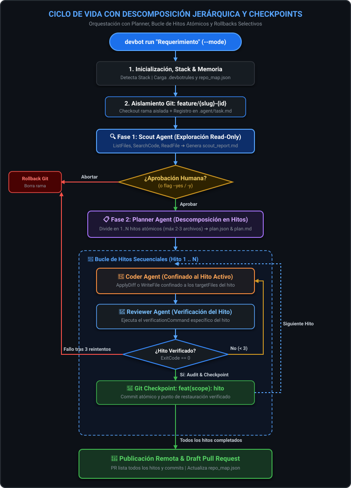
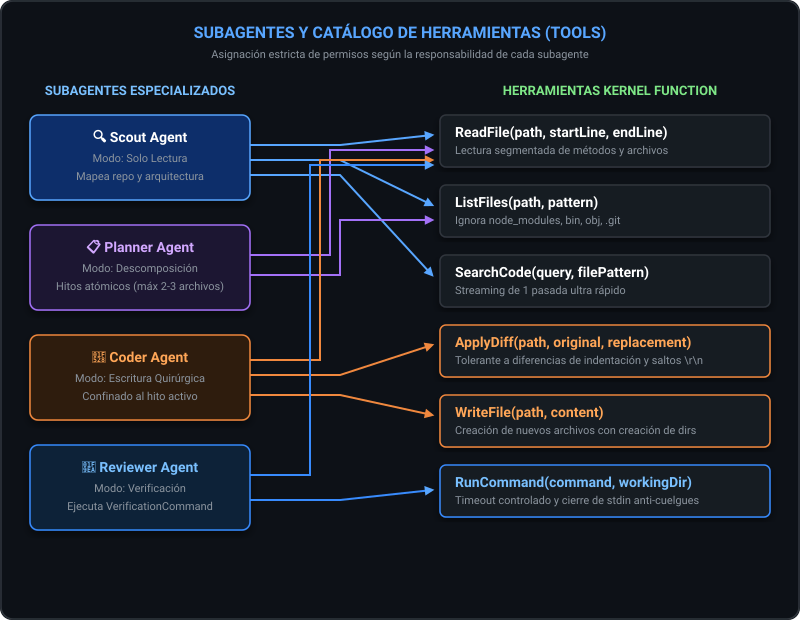
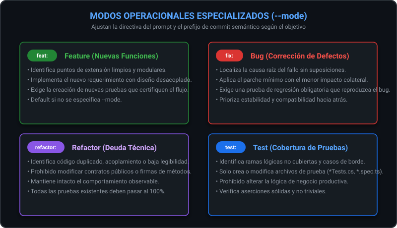
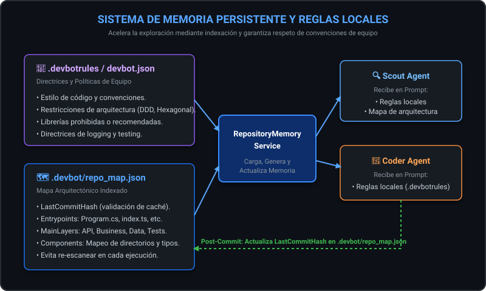
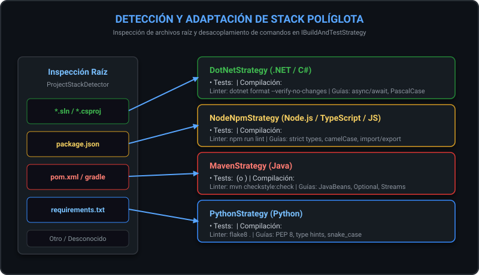
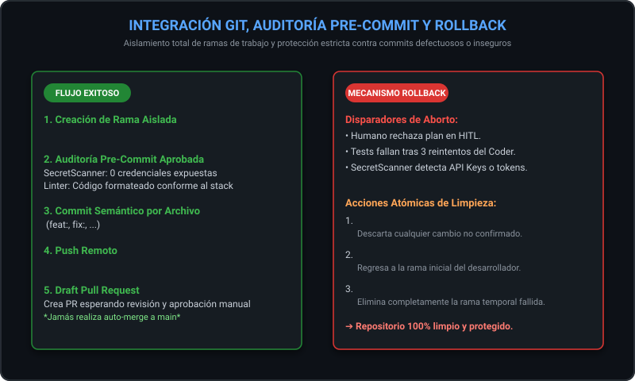

# DevBot.Cli - Manual Técnico de Arquitectura y Funcionamiento

**DevBot.Cli** es un asistente de ingeniería de software autónomo y modular desarrollado en **C# y .NET 8**, impulsado por **Semantic Kernel** y estilizado mediante **Spectre.Console**. 

Su propósito es ejecutar tareas de desarrollo quirúrgicas sobre repositorios de código real: exploración arquitectónica, codificación de cambios mínimos, ejecución y validación de pruebas unitarias, auditoría de seguridad pre-commit y apertura de Pull Requests.

---

## 📑 Tabla de Contenidos
1. [Arquitectura General y Ciclo Agéntico](#1-arquitectura-general-y-ciclo-agéntico)
2. [Subagentes Especializados](#2-subagentes-especializados)
3. [Catálogo de Herramientas (Tools)](#3-catálogo-de-herramientas-tools)
4. [Modos Operacionales (`--mode`)](#4-modos-operacionales---mode)
5. [Sistema de Memoria Persistente y Reglas Locales](#5-sistema-de-memoria-persistente-y-reglas-locales)
6. [Estrategias y Detección de Stack Políglota](#6-estrategias-y-detección-de-stack-políglota)
7. [Interacción con Git, Auditoría Pre-Commit y Rollback](#7-interacción-con-git-auditoría-pre-commit-y-rollback)
8. [Auditoría de Seguridad y Detección de Secretos](#8-auditoría-de-seguridad-y-detección-de-secretos)
9. [Human-in-the-Loop (HITL)](#9-human-in-the-loop-hitl)
10. [Guía Rápida de Uso en Línea de Comandos](#10-guía-rápida-de-uso-en-línea-de-comandos)

---

## 1. Arquitectura General y Ciclo Agéntico

DevBot implementa un flujo de ciclo de vida orquestado por `Orchestrator.cs`. El flujo garantiza que ningún cambio se integre a la rama principal sin validación estricta de compilación, ejecución de tests y análisis de seguridad.

### Diagrama de Ciclo de Vida Completo



---

## 2. Subagentes Especializados

DevBot no utiliza un único prompt generalista. Divide las responsabilidades en subagentes con contextos y plugins estrictamente delimitados:

| Subagente | Responsabilidad Principal | Herramientas Asignadas | Salida Generada |
| :--- | :--- | :--- | :--- |
| **Scout Agent** | Analiza la arquitectura del repositorio, ubica archivos clave y redacta el plano técnico. Es **estrictamente de solo lectura**. | `ReadFile`, `ListFiles`, `SearchCode` | `.agent/scout_report.md` |
| **Planner Agent** | Descompone tareas complejas de abajo hacia arriba (*Bottom-Up*) en hitos atómicos (máx 2-3 archivos) con comandos de verificación. | `ReadFile`, `ListFiles` | `.agent/plan.json`, `.agent/plan.md` |
| **Coder Agent** | Aplica modificaciones quirúrgicas y mínimas confinadas al alcance del hito activo respetando `.devbotrules`. | `ReadFile`, `WriteFile`, `ApplyDiff` | Archivos modificados en disco |
| **Reviewer Agent** | Ejecuta el comando de verificación específico del hito (`VerificationCommand`), captura errores y valida `ExitCode == 0`. | `RunCommand`, `ReadFile` | `.agent/review_results.md` |

---

## 3. Catálogo de Herramientas (Tools)

Las herramientas son funciones de C# decoradas con `[KernelFunction]` que Semantic Kernel expone al LLM en tiempo de ejecución.

### Matriz de Herramientas por Agente



### Detalle Técnico de Cada Herramienta

#### 1. `ReadFile(string filePath, int? startLine, int? endLine)`
- **Uso:** Lectura segura de código. Permite leer archivos enteros o fragmentos delimitados por rangos de líneas.
- **Optimización:** Previene saturación de la ventana de contexto al inspeccionar métodos específicos.

#### 2. `ListFiles(string directoryPath, string searchPattern)`
- **Uso:** Inspección del árbol de directorios.
- **Protección:** Excluye automáticamente directorios de dependencias o compilación pesados (`.git`, `node_modules`, `bin`, `obj`, `.agent`).

#### 3. `SearchCode(string query, string filePattern)`
- **Uso:** Búsqueda textual o por patrones en el código base.
- **Optimización:** Implementado mediante streaming (`File.ReadLines`) con lectura de una sola pasada por archivo, evitando cargar gigabytes de código en memoria RAM.

#### 4. `ApplyDiff(string filePath, string originalSnippet, string replacementSnippet)`
- **Uso:** Modificación quirúrgica de archivos existentes.
- **Robustez:** Cuenta con un algoritmo de **tolerancia a espacios en blanco e indentación** que localiza el bloque objetivo aun cuando el LLM emita pequeñas variaciones en la indentación de espacios/tabs o retornos de carro (`\r\n` vs `\n`).

#### 5. `WriteFile(string filePath, string content)`
- **Uso:** Creación de nuevos archivos o sobrescritura completa cuando se requiere un archivo nuevo desde cero.
- **Seguridad:** Crea los directorios padre de forma recursiva si no existen.

#### 6. `TerminalTools.RunCommand(string command, string workingDirectory)`
- **Uso:** Ejecución de comandos del sistema operativo (compilación, pruebas unitarias, linters).
- **Protección contra Bloqueos (Deadlocks):** Cierra inmediatamente el flujo `StandardInput` (`process.StandardInput.Close()`) para evitar que comandos interactivos que solicitan confirmación bloqueen el proceso. Implementa un timeout configurable.

---

## 4. Modos Operacionales (`--mode`)

DevBot ajusta el comportamiento y las directrices de los prompts según el objetivo de la misión:



### Auto-Detección y Forzado Manual (Override)
- **Auto-Detección por defecto (`auto` o si se omite `--mode`):** DevBot analiza semánticamente la descripción de la tarea antes de iniciar. Si detecta términos de bug (`error`, `exception`, `fix`, `falla`, etc.) activa `bug`; si detecta términos de pruebas (`test`, `cobertura`, `assert`) activa `test`; si detecta refactorización (`refactor`, `optimizar`, `limpiar`) activa `refactor`; de lo contrario adopta `feature`.
- **Forzado Manual:** Puedes anular la detección automática y forzar una política estricta indicando `--mode <feature|bug|refactor|test>`.

### Tabla Comparativa de Políticas

| Modo | Política Scout | Política Coder | Política Reviewer | Prefijo Commit |
| :--- | :--- | :--- | :--- | :--- |
| **`feature`** | Identifica puntos de extensión y diseño modular. | Diseña soluciones limpias y extensibles con sus tests. | Valida compatibilidad y que se añadan pruebas de la nueva funcionalidad. | `feat:` |
| **`bug`** | Identifica el punto exacto de falla y la causa raíz. | Aplica el cambio mínimo posible para corregir el defecto sin efectos secundarios. | Exige una prueba de regresión que falle sin el parche y pase con él. | `fix:` |
| **`refactor`** | Identifica código duplicado o deuda técnica sin modificar contratos públicos. | Prohibido alterar firmas públicas, endpoints o contratos de API. | Exige que todas las pruebas previas pasen al 100%. | `refactor:` |
| **`test`** | Mapea código no cubierto, ramas condicionales y casos extremos. | Solo añade o complementa archivos de prueba (`*Test*.cs`, `*.spec.ts`, etc.). | Verifica aumento efectivo de cobertura y calidad de aserciones. | `test:` |

---

## 5. Sistema de Memoria Persistente y Reglas Locales

DevBot no empieza de cero en cada ejecución ni ignora las convenciones del equipo.



### 1. Reglas Locales (`.devbotrules` o `devbot.json`)
Permite al equipo definir directrices técnicas que DevBot respetará rigurosamente:
```markdown
# .devbotrules
- Usar siempre inyección de dependencias por constructor.
- No utilizar System.Console directamente, utilizar ILogger.
- Mantener funciones menores a 40 líneas.
- Toda entidad de dominio debe ser inmutable.
```
Estas reglas se inyectan automáticamente en el prompt del **Scout** y en cada iteración del **Coder**.

### 2. Mapa del Repositorio (`.devbot/repo_map.json`)
Si el commit hash del repositorio no ha cambiado desde la última ejecución, DevBot reutiliza el mapa en caché, reduciendo drásticamente el consumo de tokens y el tiempo de análisis.

El mapa almacena:
- **`Entrypoints`**: Localiza archivos como `Program.cs`, `Startup.cs`, `index.ts`, `main.py`, etc.
- **`MainLayers`**: Identifica y clasifica capas del sistema:
  - `Presentation / API` (Controllers, Routes, Endpoints)
  - `Business Logic / Application` (Services, UseCases, Handlers)
  - `Domain / Models` (Entities, DTOs, Domain)
  - `Data Access / Infrastructure` (Data, Repositories, Persistence)
  - `Shared / Core` (Core, Utils, Common)
  - `Testing` (Tests, __tests__)
- **`Components`**: Registro de directorios y tipos clave.

---

## 6. Estrategias y Detección de Stack Políglota

DevBot detecta automáticamente el stack tecnológico del proyecto inspeccionando los archivos raíz mediante `ProjectStackDetector`:



Cada estrategia proporciona:
1. **Comando de Compilación / Pruebas:** Ejecutado por el `ReviewerAgent`.
2. **Comando de Auditoría / Linter:** Ejecutado por el `PreCommitAuditor`.
3. **Guías Idiomáticas:** Consejos específicos del lenguaje inyectados en el prompt del Coder (p.ej., convenciones de nombrado C# PascalCase vs. camelCase en TypeScript, uso de `async/await`, etc.).

---

## 7. Interacción con Git, Auditoría Pre-Commit y Rollback

DevBot aísla completamente su trabajo en ramas temporales y proporciona un mecanismo de rollback de seguridad:



### Mecanismo de Rollback
Si los subagentes no logran pasar las pruebas o la auditoría de seguridad detecta secretos expuestos:
1. DevBot ejecuta `git reset --hard HEAD`.
2. Regresa a la rama original del desarrollador (`git checkout <originalBranch>`).
3. Elimina la rama temporal de trabajo (`git branch -D <targetBranch>`).
4. El repositorio local queda exactamente en el mismo estado en que se encontraba antes de iniciar DevBot.

---

## 8. Auditoría de Seguridad y Detección de Secretos

Antes de crear cualquier commit, el componente `SecretScanner.cs` inspecciona línea por línea el contenido de todos los archivos modificados mediante expresiones regulares precompiladas de alto rendimiento:

| Regla | Tipo de Secreto | Patrón / Firma |
| :--- | :--- | :--- |
| **`SEC001`** | Google Cloud / Gemini API Keys | `AIza[0-9A-Za-z\-_]{35}`, `AQ\.[0-9A-Za-z\-_]{35}` |
| **`SEC002`** | OpenAI / Anthropic Secret Keys | `sk-[A-Za-z0-9\-_]{20,}` |
| **`SEC003`** | GitHub Personal Access Tokens | `ghp_[0-9A-Za-z]{36}`, `gho_...` |
| **`SEC004`** | AWS Access Key ID | `AKIA[0-9A-Z]{16}` |
| **`SEC005`** | JSON Web Tokens (JWT) | `eyJ[A-Za-z0-9-_=]+\.eyJ[A-Za-z0-9-_=]+\.[A-Za-z0-9-_.+/=]*` |
| **`SEC006`** | Claves Privadas PEM | `-----BEGIN (RSA \|EC \|DSA \|OPENSSH \|)PRIVATE KEY-----` |
| **`SEC007`** | Contraseñas en Cadenas de Conexión | `(Password\|pwd\|User Id)=[^;]+` |

### Enmascaramiento Seguro (Redaction)
Cuando se detecta un hallazgo, el valor del secreto **jamás se imprime en texto claro** ni en los logs ni en la consola:
```text
Valor original:  AIzaSyD-1234567890abcdefghijklmnopqrstuv
Valor redactado: AIzaSyD-1234****...****klmnopqrstuv
```

---

## 9. Human-in-the-Loop (HITL)

Tras la fase de exploración del Scout Agent, DevBot detiene la ejecución y extrae un resumen ejecutivo del plan:
- **Archivos a modificar o crear.**
- **Enfoque técnico sugerido.**
- **Comandos de verificación que se ejecutarán.**

El desarrollador tiene 3 opciones interactivas:
1. **Aprobar:** DevBot procede inmediatamente a la fase Coder.
2. **Aclarar / Modificar:** El desarrollador ingresa texto con directrices adicionales (por ejemplo: *"No toques la clase AuthController, refactoriza únicamente el TokenService"*). DevBot inyecta esta directriz en el Coder.
3. **Abortar:** DevBot cancela la ejecución, realiza rollback y limpia la rama de trabajo.

> **Uso en CI/CD:** Para pipelines automatizados o ejecuciones desatendidas, el flag `--yes` / `-y` aprueba automáticamente el plan del Scout.

---

## 10. Guía Rápida de Uso en Línea de Comandos

```bash
# 1. Ejecutar una tarea con confirmación interactiva humana (Modo Feature por defecto)
devbot run "Agregar endpoint GET /api/v1/health con métricas de memoria"

# 2. Ejecutar corrección de un bug en modo interactivo
devbot run "Corregir NullReferenceException en InvoiceService" --mode bug

# 3. Ejecutar refactorización en modo automático (para CI/CD o scripts)
devbot run "Separar responsabilidades de OrderProcessor a OrderValidator" --mode refactor --yes

# 4. Generar nuevas pruebas unitarias para aumentar cobertura
devbot run "Agregar pruebas unitarias para PaymentGateway" -M test -y

# 5. Ver ayuda y opciones disponibles
devbot --help
```
