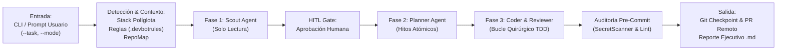
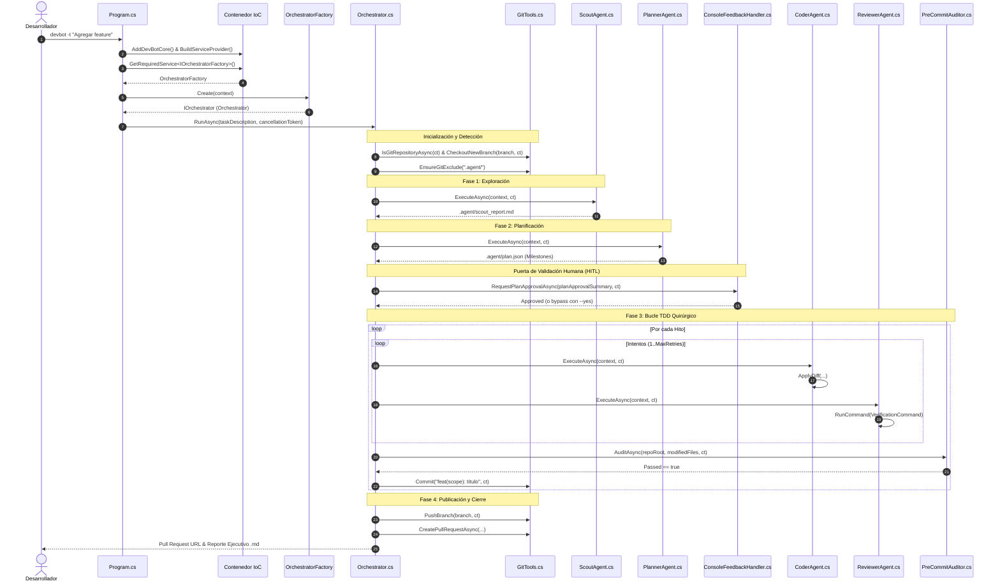

# Onboarding Técnico y Guía Arquitectónica: DevBot CLI

Guía técnica integral para desarrolladores y arquitectos que ingresan al proyecto **DevBot**. Este documento detalla el propósito del sistema, su arquitectura desacoplada con **Inyección de Dependencias (DI)**, sus componentes internos, la ruta crítica de ejecución y pautas prácticas para extender el código base.

---

## 📑 Tabla de Contenidos
1. [Visión General y Propósito del Sistema](#1-visión-general-y-propósito-del-sistema)
2. [Mapa Arquitectónico y Estructura del Proyecto](#2-mapa-arquitectónico-y-estructura-del-proyecto)
3. [Inyección de Dependencias y Contenedor IoC](#3-inyección-de-dependencias-y-contenedor-ioc)
4. [Glosario de Conceptos y Terminología Interna](#4-glosario-de-conceptos-y-terminología-interna)
5. [Ruta Crítica de Ejecución (Cómo leer el código)](#5-ruta-crítica-de-ejecución-cómo-leer-el-código)
6. [Configuración, Estado y Dependencias Externas](#6-configuración-estado-y-dependencias-externas)
7. [Guía de Lectura Rápida para Desarrolladores (Cheat Sheet)](#7-guía-de-lectura-rápida-para-desarrolladores-cheat-sheet)

---

## 1. Visión General y Propósito del Sistema

### ¿Qué problema resuelve "DevBot"?
El desarrollo de software asistido por Modelos de Lenguaje (LLM) suele fallar en proyectos reales debido a tres problemas estructurales:
1. **Alucinación destructiva y pérdida de contexto:** Cuando se le pide a un LLM generalista modificar un archivo mediano o grande, tiende a reescribir todo el archivo, omitiendo código existente o violando convenciones del proyecto.
2. **Falta de verificación determinista:** El código sugerido por la IA muchas veces no compila o rompe pruebas unitarias sin que nadie lo valide en tiempo real antes de integrarlo.
3. **Fugas de seguridad y regresiones:** Cambios no supervisados pueden introducir secretos (*hardcoded API keys*), vulnerabilidades o alteraciones a contratos públicos de APIs existentes.

**DevBot** resuelve este problema funcionando como un **agente autónomo de ingeniería de software CLI** desarrollado en **C# y .NET 8**, impulsado por **Microsoft Semantic Kernel**, **Google Gemini** y **Microsoft.Extensions.DependencyInjection**.

### Flujo Funcional de Alto Nivel


1. **Entrada de Información:** Parámetros por línea de comandos analizados por [CliArgumentsParser.cs](file:///c:/Users/pc/Desktop/Proyectos/BotCLI/src/DevBot.Cli/Core/Configuration/CliArgumentsParser.cs) o prompts interactivos de [Spectre.Console](file:///c:/Users/pc/Desktop/Proyectos/BotCLI/src/DevBot.Cli/Program.cs#L63-L104).
2. **Procesamiento del Requerimiento:**
   - Creación de rama de trabajo aislada (`feature/slug-fecha`).
   - Detección automática del stack tecnológico (.NET, Node.js, Python, Java).
   - Carga de memoria del repositorio (`.devbot/repo_map.json`) y directrices de equipo (`.devbotrules`).
   - Exploración arquitectónica de solo lectura ([ScoutAgent](file:///c:/Users/pc/Desktop/Proyectos/BotCLI/src/DevBot.Cli/Subagents/ScoutAgent.cs)).
   - Puerta de confirmación humana (*Human-in-the-Loop*).
   - Descomposición jerárquica en hitos ([PlannerAgent](file:///c:/Users/pc/Desktop/Proyectos/BotCLI/src/DevBot.Cli/Subagents/PlannerAgent.cs)).
   - Bucle cerrado de modificación quirúrgica ([CoderAgent](file:///c:/Users/pc/Desktop/Proyectos/BotCLI/src/DevBot.Cli/Subagents/CoderAgent.cs)) y validación de pruebas en terminal ([ReviewerAgent](file:///c:/Users/pc/Desktop/Proyectos/BotCLI/src/DevBot.Cli/Subagents/ReviewerAgent.cs)).
   - Auditoría de credenciales expuestas ([PreCommitAuditor](file:///c:/Users/pc/Desktop/Proyectos/BotCLI/src/DevBot.Cli/Core/Auditing/PreCommitAuditor.cs)).
3. **Salida del Sistema:** Commits incrementales por hito, publicación en rama remota (`git push`), apertura de Pull Request (`gh pr create` o enlace GitHub Compare), y generación de un reporte ejecutivo Markdown en `.agent/latest_run_report.md`.

---

## 2. Mapa Arquitectónico y Estructura del Proyecto

### Principios de Diseño
El código base sigue los estándares más exigentes de la industria .NET:
- **Clean Architecture & Ports/Adapters:** Separación nítida entre dominio, casos de uso agénticos, configuración e infraestructura.
- **StyleCop SA1402 (Un tipo por archivo):** Cada clase, record, interface o enum público reside en su propio archivo con nombre idéntico.
- **Inversión de Dependencias (DIP):** Todos los servicios, subagentes y herramientas se resuelven a través de `IServiceProvider`.
- **Inmutabilidad y Thread-Safety:** Modelos con modificadores `sealed record` / `init` y colecciones que devuelven copias defensivas o de solo lectura (`IReadOnlyList<T>`, `[.. coleccion]`).

### Desglose del Árbol de Carpetas
```
BotCLI/
├── src/
│   └── DevBot.Cli/
│       ├── Core/
│       │   ├── Auditing/             # Escaneo de credenciales y calidad pre-commit
│       │   │   ├── AuditResult.cs        # Dictamen consolidado de auditoría
│       │   │   ├── IPreCommitAuditor.cs  # Contrato de auditoría
│       │   │   ├── PreCommitAuditor.cs   # Ejecutor de escaneo y linter
│       │   │   ├── SecretScanner.cs      # Motor regex de detección de secretos
│       │   │   └── SecurityFinding.cs    # Modelo atómico de hallazgo enmascarado
│       │   ├── Configuration/        # Parseo de CLI y gestión de credenciales
│       │   │   ├── CliArgumentsParser.cs # Parser desacoplado de flags de consola
│       │   │   ├── CliOptions.cs         # Record fuertemente tipado de opciones
│       │   │   ├── CredentialStorageService.cs # Persistencia en ~/.devbot/api_key
│       │   │   └── ICredentialStorageService.cs # Contrato de almacenamiento de secretos
│       │   ├── DependencyInjection/  # Contenedor IoC
│       │   │   └── ServiceCollectionExtensions.cs # Registros con AddDevBotCore()
│       │   ├── Diagnostics/          # Presentación de diagnósticos en consola
│       │   │   └── DiagnosticViewService.cs # Visualizador de --report y --logs
│       │   ├── Interactive/          # Human-in-the-Loop (HITL)
│       │   │   ├── ConsoleFeedbackHandler.cs # Handler interactivo Spectre.Console
│       │   │   ├── HumanDecision.cs      # Decisión y directivas del desarrollador
│       │   │   ├── HumanDecisionType.cs  # Enum: Approved, Clarified, Aborted
│       │   │   ├── IHumanFeedbackHandler.cs # Contrato de interacción humana
│       │   │   ├── PlanApprovalSummary.cs # Resumen integral del plan de hitos para aprobación
│       │   │   ├── ScoutPlanExtractor.cs # Extractor del resumen diagnóstico
│       │   │   └── ScoutPlanSummary.cs   # Resumen ejecutivo para presentación
│       │   ├── Memory/               # Caché semántico y reglas locales
│       │   │   ├── IRepositoryMemoryService.cs # Contrato de memoria de repositorio
│       │   │   ├── RepoComponentInfo.cs  # Metadata de componentes y capas
│       │   │   ├── RepoMap.cs            # Mapa estructurado del repositorio
│       │   │   └── RepositoryMemoryService.cs # Generación y serialización de repo_map.json
│       │   ├── Modes/                # Políticas operacionales (feature, bug, refactor, test)
│       │   │   ├── AgentMode.cs          # Enum de modos de operación
│       │   │   ├── ModePolicy.cs         # Record con directrices especializadas
│       │   │   └── ModePolicyRegistry.cs # Parser y auto-detección semántica
│       │   ├── Planning/             # Descomposición de tareas en hitos
│       │   │   ├── PlanDefinition.cs     # Plan consolidado con serialización JSON/MD
│       │   │   └── PlanMilestone.cs      # Hito atómico con comando de verificación
│       │   ├── Strategies/           # Adaptadores políglotas de compilación y test
│       │   │   ├── DotNetStrategy.cs     # Estrategia para .NET (dotnet build/test/format)
│       │   │   ├── GenericFallbackStrategy.cs # Fallback genérico
│       │   │   ├── IBuildAndTestStrategy.cs # Contrato de estrategia políglota
│       │   │   ├── IProjectStackDetector.cs # Contrato de detección de stack
│       │   │   ├── MavenStrategy.cs      # Estrategia Java (mvn test)
│       │   │   ├── NodeNpmStrategy.cs    # Estrategia Node.js (npm test)
│       │   │   ├── ProjectStackDetector.cs # Analizador de archivos de solución
│       │   │   ├── ProjectStackInfo.cs   # Metadata de stack detectado
│       │   │   ├── ProjectStackType.cs   # Enum de lenguajes y herramientas
│       │   │   ├── PythonStrategy.cs     # Estrategia Python (pytest)
│       │   │   ├── StrategyExecutionResult.cs # DTO de resultado de comandos
│       │   │   └── StrategyResolver.cs   # Factory de resolución de estrategias
│       │   ├── AgentContext.cs       # Bus de estado mutable de la ejecución
│       │   ├── AgentLogger.cs        # Servicio de logging estructurado (.log/.json)
│       │   ├── AgentPhaseMetric.cs   # Métricas de telemetría atómica por fase
│       │   ├── ExecutionMetrics.cs   # Cronómetro y agregador de métricas thread-safe
│       │   ├── IOrchestrator.cs      # Contrato abstracto del orquestador
│       │   ├── IOrchestratorFactory.cs # Contrato de fábrica abstracta para creación desacoplada
│       │   ├── LogEntry.cs           # Entrada individual de auditoría
│       │   ├── Orchestrator.cs       # Orquestador y máquina de estados con DI (implementa IOrchestrator)
│       │   ├── OrchestratorFactory.cs # Fábrica concreta con Primary Constructor e inyección de subagentes
│       │   └── RunReportGenerator.cs # Generador de reportes Markdown finales
│       ├── Prompts/                  # Metaprompts base (.txt) y cargador de recursos
│       ├── Subagents/                # Especialistas LLM (Scout, Planner, Coder, Reviewer)
│       │   ├── ICoderAgent.cs        # Contrato segregado para CoderAgent
│       │   ├── IPlannerAgent.cs      # Contrato segregado para PlannerAgent
│       │   ├── IReviewerAgent.cs     # Contrato segregado para ReviewerAgent
│       │   ├── IScoutAgent.cs        # Contrato segregado para ScoutAgent
│       │   ├── ISubagent.cs          # Contrato base de subagente
│       │   ├── SubagentBase.cs       # Clase base con bucle de chat, reintentos y tokens
│       │   ├── ScoutAgent.cs         # Agente de exploración y lectura
│       │   ├── PlannerAgent.cs       # Agente de descomposición jerárquica
│       │   ├── CoderAgent.cs         # Agente de implementación quirúrgica
│       │   └── ReviewerAgent.cs      # Agente de verificación y QA determinista
│       ├── Tools/                    # Plugins de Semantic Kernel (Git, Archivos, Terminal)
│       │   ├── IGitTools.cs          # Contrato desacoplado de Git y GitHub CLI
│       │   ├── GitTools.cs           # Implementación con vinculación de CancellationToken
│       │   ├── FileTools.cs          # Manipulación quirúrgica de archivos y diffs
│       │   └── TerminalTools.cs      # Ejecución de comandos del SO con aislamiento
│       ├── Program.cs                # Composition Root desacoplado con métodos SLAP
│       └── DevBot.Cli.csproj         # Definición de dependencias (.NET 8 Tool)
├── tests/
│   └── DevBot.Tests/                 # Suite de 103 pruebas unitarias xUnit
└── docs/                             # Diagramas y documentación complementaria
```

---

## 3. Inyección de Dependencias y Contenedor IoC

El motor implementa rigurosamente el principio de **Inversión de Dependencias (DIP)** y el **Patrón Factory** utilizando `Microsoft.Extensions.DependencyInjection`:

### Configuración del Contenedor ([ServiceCollectionExtensions.cs](file:///c:/Users/pc/Desktop/Proyectos/BotCLI/src/DevBot.Cli/Core/DependencyInjection/ServiceCollectionExtensions.cs))
```csharp
public static IServiceCollection AddDevBotCore(this IServiceCollection services)
{
    // Servicios Singleton (stateless e infraestructura)
    services.AddSingleton<IProjectStackDetector, ProjectStackDetector>();
    services.AddSingleton<IRepositoryMemoryService, RepositoryMemoryService>();
    services.AddSingleton<IPreCommitAuditor, PreCommitAuditor>();
    services.AddSingleton<ICredentialStorageService, CredentialStorageService>();

    // Subagentes Transient (interfaces y tipos concretos)
    services.AddTransient<IScoutAgent, ScoutAgent>();
    services.AddTransient<IPlannerAgent, PlannerAgent>();
    services.AddTransient<ICoderAgent, CoderAgent>();
    services.AddTransient<IReviewerAgent, ReviewerAgent>();
    services.AddTransient<ScoutAgent>();
    services.AddTransient<PlannerAgent>();
    services.AddTransient<CoderAgent>();
    services.AddTransient<ReviewerAgent>();

    // Orquestador y Fábrica Abstracta
    services.AddTransient<IOrchestratorFactory, OrchestratorFactory>();
    services.AddTransient<Orchestrator>();

    return services;
}
```

### Patrón Factory Desacoplado en `Program.cs`
Para evitar el antipatrón de reflexión con `ActivatorUtilities`, la instanciación de `Orchestrator` (que combina dependencias registradas en IoC con el `context` resuelto en tiempo de ejecución) se delega limpiamente a [IOrchestratorFactory](file:///c:/Users/pc/Desktop/Proyectos/BotCLI/src/DevBot.Cli/Core/IOrchestratorFactory.cs):
```csharp
var orchestratorFactory = serviceProvider.GetRequiredService<IOrchestratorFactory>();
var orchestrator = orchestratorFactory.Create(context);
```
Esto garantiza:
1. **Tipado fuerte en compilación:** Cero invocaciones reflectivas o cadenas dinámicas.
2. **Testabilidad absoluta:** En pruebas unitarias se puede inyectar un mock de `IOrchestratorFactory` que devuelva un mock de `IOrchestrator`.
3. **Pureza arquitectónica:** Cumple con la directiva oficial de `dotnet-best-practices` ("Follow the Factory pattern for complex object creation").

---

## 4. Glosario de Conceptos y Terminología Interna

- **Composition Root:**
  - *Concepto:* El único punto de la aplicación donde se compone el grafo de dependencias de todo el sistema ([Program.cs](file:///c:/Users/pc/Desktop/Proyectos/BotCLI/src/DevBot.Cli/Program.cs)).
- **AgentContext:** 
  - *Concepto:* Bus de estado mutable en memoria que acompaña la vida de la tarea (rutas de artefactos, archivos modificados, métricas, modo activo, estrategia de compilación).
  - *Representación física:* [AgentContext.cs](file:///c:/Users/pc/Desktop/Proyectos/BotCLI/src/DevBot.Cli/Core/AgentContext.cs).
- **Subagente (ISubagent):**
  - *Concepto:* Especialista LLM provisto únicamente de las herramientas necesarias para su rol (Principio de Mínimo Privilegio).
  - *Representación física:* [ISubagent.cs](file:///c:/Users/pc/Desktop/Proyectos/BotCLI/src/DevBot.Cli/Subagents/ISubagent.cs) y [SubagentBase.cs](file:///c:/Users/pc/Desktop/Proyectos/BotCLI/src/DevBot.Cli/Subagents/SubagentBase.cs).
- **Milestone (Hito Atómico):**
  - *Concepto:* Unidad indivisible de trabajo que abarca a lo sumo 2 o 3 archivos y cuenta con su propio comando determinista de verificación.
  - *Representación física:* [PlanMilestone.cs](file:///c:/Users/pc/Desktop/Proyectos/BotCLI/src/DevBot.Cli/Core/Planning/PlanMilestone.cs).
- **Checkpoint Commit:**
  - *Concepto:* Commit incremental en Git generado cuando un hito aprueba todas las pruebas unitarias y la auditoría pre-commit.
  - *Representación física:* [Orchestrator.cs](file:///c:/Users/pc/Desktop/Proyectos/BotCLI/src/DevBot.Cli/Core/Orchestrator.cs#L299-L315).
- **RepoMap:**
  - *Concepto:* Representación estructurada JSON del repositorio (puntos de entrada, capas y componentes) indexada por commit hash en `.devbot/repo_map.json`.
  - *Representación física:* [RepoMap.cs](file:///c:/Users/pc/Desktop/Proyectos/BotCLI/src/DevBot.Cli/Core/Memory/RepoMap.cs).
- **SecretScanner & SecurityFinding:**
  - *Concepto:* Motor regex que busca claves API privadas (AWS, GitHub, Google, JWT, Slack, PEM) en el código modificado antes de hacer commit.
  - *Representación física:* [SecretScanner.cs](file:///c:/Users/pc/Desktop/Proyectos/BotCLI/src/DevBot.Cli/Core/Auditing/SecretScanner.cs) y [SecurityFinding.cs](file:///c:/Users/pc/Desktop/Proyectos/BotCLI/src/DevBot.Cli/Core/Auditing/SecurityFinding.cs).
- **Human-in-the-Loop (HITL):**
  - *Concepto:* Puerta de validación interactiva donde el desarrollador audita, aprueba o enriquece el plan estructurado en hitos por el Planner antes de alterar archivos en disco.
  - *Representación física:* [ConsoleFeedbackHandler.cs](file:///c:/Users/pc/Desktop/Proyectos/BotCLI/src/DevBot.Cli/Core/Interactive/ConsoleFeedbackHandler.cs) y [PlanApprovalSummary.cs](file:///c:/Users/pc/Desktop/Proyectos/BotCLI/src/DevBot.Cli/Core/Interactive/PlanApprovalSummary.cs).
- **IOrchestratorFactory:**
  - *Concepto:* Fábrica abstracta desacoplada que construye instancias de `IOrchestrator` combinando servicios registrados en IoC con el contexto de corrida (`AgentContext`) sin usar reflexión.
  - *Representación física:* [IOrchestratorFactory.cs](file:///c:/Users/pc/Desktop/Proyectos/BotCLI/src/DevBot.Cli/Core/IOrchestratorFactory.cs) y [OrchestratorFactory.cs](file:///c:/Users/pc/Desktop/Proyectos/BotCLI/src/DevBot.Cli/Core/OrchestratorFactory.cs).
- **IGitTools:**
  - *Concepto:* Contrato abstracto que encapsula todas las operaciones de control de versiones y GitHub CLI con soporte nativo de cancelación cooperativa (`CancellationToken`).
  - *Representación física:* [IGitTools.cs](file:///c:/Users/pc/Desktop/Proyectos/BotCLI/src/DevBot.Cli/Tools/IGitTools.cs) y [GitTools.cs](file:///c:/Users/pc/Desktop/Proyectos/BotCLI/src/DevBot.Cli/Tools/GitTools.cs).

---

## 5. Ruta Crítica de Ejecución y Guía de Lectura del Código

Esta sección está diseñada para que cualquier desarrollador pueda leer, auditar y depurar el 100% del código fuente siguiendo el hilo lógico de ejecución.

### 5.1 Catálogo Estructurado de Clases, Interfaces, Dependencias y Métodos

A continuación se presenta la lista numerada y clasificada por capas de todos los componentes del sistema, detallando sus contratos, dependencias inyectadas por constructor y la descripción de cada uno de sus métodos:

#### 1. Capa de Entrada y CLI

##### 1.1 [`Program`](file:///c:/Users/pc/Desktop/Proyectos/BotCLI/src/DevBot.Cli/Program.cs)
* **Archivo:** `src/DevBot.Cli/Program.cs`
* **Rol:** Composition Root y punto de entrada de la aplicación de consola.
* **Dependencias inyectadas:** Ninguna (resuelve dependencias desde el contenedor local `ServiceProvider`).
* **Métodos:**
  * `Main(string[] args)`: Método de entrada asíncrono. Coordina el arranque, atiende comandos rápidos, arma el contenedor IoC, resuelve `IOrchestratorFactory` y ejecuta la tarea.
  * `ConfigureConsole()`: Configura codificación `UTF-8` en la terminal y renderiza el banner ASCII con `Spectre.Console`.
  * `TryHandleImmediateCommands(CliOptions options, out int exitCode)`: Evalúa si el usuario solicitó `--help`, `--report` o `--logs`. Si es así, despacha el comando y retorna `true` para salir temprano.
  * `BuildServiceProvider()`: Configura y compila la colección de servicios con `services.AddDevBotCore()`.
  * `ResolveTaskDescription(CliOptions options)`: Retorna la tarea provista por CLI o abre un prompt interactivo si no se especificó.
  * `ResolveAgentMode(CliOptions options, string taskDescription)`: Determina si el modo fue forzado con `--mode` o lo auto-detecta mediante análisis semántico con `ModePolicyRegistry.DetectMode`.
  * `ResolveApiKey(CliOptions options, ICredentialStorageService credentialStorage)`: Resuelve la clave de Gemini escalonadamente (CLI ➔ variable de entorno ➔ archivo en disco ➔ prompt secreto).
  * `CreateAgentContext(CliOptions options, string apiKey, AgentMode mode)`: Ensambla la instancia de `AgentContext` con las opciones validadas.
  * `ExecuteWithCancellationAsync(IOrchestrator orchestrator, string taskDescription)`: Ejecuta la misión suscribiendo un handler a `Console.CancelKeyPress` para capturar `Ctrl+C` y asegurando su desuscripción en el bloque `finally`.

##### 1.2 [`CliArgumentsParser`](file:///c:/Users/pc/Desktop/Proyectos/BotCLI/src/DevBot.Cli/Core/Configuration/CliArgumentsParser.cs)
* **Archivo:** `src/DevBot.Cli/Core/Configuration/CliArgumentsParser.cs`
* **Rol:** Parser desacoplado y fuertemente tipado de flags de consola.
* **Dependencias inyectadas:** Ninguna (métodos estáticos puros).
* **Métodos:**
  * `Parse(string[] args)`: Recorre los argumentos de línea de comandos y produce una instancia inmutable de [`CliOptions`](file:///c:/Users/pc/Desktop/Proyectos/BotCLI/src/DevBot.Cli/Core/Configuration/CliOptions.cs).
  * `PrintHelp()`: Renderiza en consola una tabla estilizada de Spectre con todos los flags disponibles, alias, descripciones y valores por defecto.

##### 1.3 [`CredentialStorageService`](file:///c:/Users/pc/Desktop/Proyectos/BotCLI/src/DevBot.Cli/Core/Configuration/CredentialStorageService.cs)
* **Archivo:** `src/DevBot.Cli/Core/Configuration/CredentialStorageService.cs`
* **Interfaz implementada:** [`ICredentialStorageService`](file:///c:/Users/pc/Desktop/Proyectos/BotCLI/src/DevBot.Cli/Core/Configuration/ICredentialStorageService.cs)
* **Rol:** Gestión y persistencia segura de la clave API en el directorio de usuario.
* **Dependencias inyectadas:** `string? baseDirectory = null` (opcional, permite inyectar una ruta temporal en pruebas unitarias).
* **Métodos:**
  * `LoadApiKey()`: Lee la clave guardada en `~/.devbot/api_key`. Retorna `null` si el archivo no existe o está vacío.
  * `SaveApiKey(string apiKey)`: Crea el directorio `~/.devbot` si no existe y persiste la clave en texto limpio con codificación UTF-8.

##### 1.4 [`DiagnosticViewService`](file:///c:/Users/pc/Desktop/Proyectos/BotCLI/src/DevBot.Cli/Core/Diagnostics/DiagnosticViewService.cs)
* **Archivo:** `src/DevBot.Cli/Core/Diagnostics/DiagnosticViewService.cs`
* **Rol:** Visualización y formateo de diagnósticos y registros históricos en terminal.
* **Dependencias inyectadas:** Ninguna (métodos estáticos de lectura de disco).
* **Métodos:**
  * `ShowLatestReport(string repoDir)`: Localiza `.agent/latest_run_report.md` en el repositorio indicado y lo imprime en pantalla como Markdown estilizado.
  * `ShowRecentLogs(string repoDir)`: Busca el archivo de log más reciente en `.agent/logs/` y muestra sus últimas 40 líneas formateadas en un panel.

---

#### 2. Capa de Fábrica y Orquestación

##### 2.1 [`OrchestratorFactory`](file:///c:/Users/pc/Desktop/Proyectos/BotCLI/src/DevBot.Cli/Core/OrchestratorFactory.cs)
* **Archivo:** `src/DevBot.Cli/Core/OrchestratorFactory.cs`
* **Interfaz implementada:** [`IOrchestratorFactory`](file:///c:/Users/pc/Desktop/Proyectos/BotCLI/src/DevBot.Cli/Core/IOrchestratorFactory.cs)
* **Rol:** Fábrica abstracta para desacoplar la creación de `Orchestrator` del contenedor IoC sin usar reflexión (`ActivatorUtilities`).
* **Dependencias inyectadas (Primary Constructor):** `IScoutAgent scoutAgent`, `IPlannerAgent plannerAgent`, `ICoderAgent coderAgent`, `IReviewerAgent reviewerAgent`, `IProjectStackDetector stackDetector`.
* **Métodos:**
  * `Create(AgentContext context)`: Valida que el contexto no sea nulo y ensambla una instancia de `Orchestrator` inyectándole los subagentes, el detector de stack y una nueva instancia de `GitTools` asociada al `context.RepoRoot`.

##### 2.2 [`Orchestrator`](file:///c:/Users/pc/Desktop/Proyectos/BotCLI/src/DevBot.Cli/Core/Orchestrator.cs)
* **Archivo:** `src/DevBot.Cli/Core/Orchestrator.cs`
* **Interfaz implementada:** [`IOrchestrator`](file:///c:/Users/pc/Desktop/Proyectos/BotCLI/src/DevBot.Cli/Core/IOrchestrator.cs)
* **Rol:** Máquina de estados central del agente. Coordina cada una de las fases de vida con control transaccional y rollback.
* **Dependencias inyectadas:** `AgentContext context`, `IScoutAgent scoutAgent`, `IPlannerAgent plannerAgent`, `ICoderAgent coderAgent`, `IReviewerAgent reviewerAgent`, `IProjectStackDetector? stackDetector = null`, `IGitTools? gitTools = null`.
* **Métodos principales:**
  * `RunAsync(string taskDescription, CancellationToken cancellationToken)`: Método principal de orquestación. Invoca secuencialmente cada método de fase garantizando la propagación de tokens de cancelación.
  * `InitializeGitWorkspaceAsync(...)`: Valida que el directorio sea un repositorio Git válido, consulta la rama actual, crea la rama de características `feature/...` y excluye `.agent/` en `.git/info/exclude`.
  * `DetectStackAndRulesAsync(...)`: Detecta el lenguaje y build tool del proyecto, resuelve la estrategia, carga `.devbotrules` y recupera o genera el mapa de arquitectura `.devbot/repo_map.json`.
  * `ExecuteScoutPhaseAsync(...)`: Invoca al `IScoutAgent` para explorar el código base y generar `.agent/scout_report.md`. Si falla, invoca la limpieza y cancela la misión.
  * `ExecutePlannerPhaseAsync(...)`: Invoca al `IPlannerAgent` para descomponer la tarea en hitos atómicos con comandos de verificación.
  * `ConfirmExecutionPlanAsync(...)`: Si `--yes` no fue provisto, construye el resumen integral del plan con los hitos y solicita aprobación humana interactiva antes de iniciar la codificación. Si el usuario aborta, revierte el workspace.
  * `ExecuteMilestonesLoopAsync(...)`: Bucle quirúrgico de hitos. Por cada hito ejecuta los intentos de código y verificación, corre la auditoría de seguridad pre-commit y genera el commit de checkpoint en Git.
  * `ExecuteMilestoneAttemptsAsync(...)`: Bucle de reintentos Coder ➔ Reviewer. Si el Reviewer aprueba (`ALL_PASS`), concluye el hito; si falla, retroalimenta los errores al Coder.
  * `AuditMilestoneChangesAsync(...)`: Ejecuta `PreCommitAuditor` sobre los archivos modificados. Si detecta secretos en texto claro (`SEC001`-`SEC007`), hace rollback al checkpoint verde previo y aborta.
  * `CommitMilestoneCheckpointAsync(...)`: Confirma los cambios verificados con formato convencional (`feat: ...`, `fix: ...`) y guarda el hash generado.
  * `PublishPullRequestAsync(...)`: Empuja la rama remota a `origin` y crea el PR mediante GitHub CLI (`gh pr create`) o genera la URL web de comparación.
  * `FinalizeRunAsync(...)`: Guarda telemetría, actualiza el hash en `.devbot/repo_map.json` y genera el reporte ejecutivo final Markdown.
  * `AbortAndCleanupAsync(string reason, ...)`: Revierte cambios pendientes (`git reset --hard HEAD`), restaura la rama original si no hubo hitos verdes y elimina la rama temporal huérfana.

---

#### 3. Capa de Subagentes e Infraestructura LLM

##### 3.1 [`SubagentBase`](file:///c:/Users/pc/Desktop/Proyectos/BotCLI/src/DevBot.Cli/Subagents/SubagentBase.cs) (Clase Abstracta)
* **Archivo:** `src/DevBot.Cli/Subagents/SubagentBase.cs`
* **Interfaz implementada:** [`ISubagent`](file:///c:/Users/pc/Desktop/Proyectos/BotCLI/src/DevBot.Cli/Subagents/ISubagent.cs)
* **Rol:** Proporciona la infraestructura compartida de interacción con Google Gemini vía Semantic Kernel.
* **Métodos:**
  * `CreateSubagentKernel(AgentContext context, IEnumerable<KernelPlugin> plugins)`: Construye una instancia limpia de `Kernel` configurada con el modelo de Gemini y los plugins restringidos del agente.
  * `RunChatLoopAsync(...)`: Bucle de llamada al modelo con spinner visual de Spectre, reintentos automáticos ante rate limits (HTTP 429) y errores temporales de conexión (HTTP 503, 502, 500).
  * `IsTransientHttpCode(int? statusCode, string message)`: Evalúa con pattern matching moderno si un código o mensaje HTTP amerita un reintento transitorio.
  * `TrackTokenUsage(ChatMessageContent response, AgentContext context)`: Extrae los metadatos de tokens (`Usage`) del payload de respuesta y los registra en las métricas del contexto.
  * `ExecuteAsync(AgentContext context, CancellationToken cancellationToken)`: Método abstracto que cada agente especialista implementa con su propia lógica de ejecución.

##### 3.2 [`ScoutAgent`](file:///c:/Users/pc/Desktop/Proyectos/BotCLI/src/DevBot.Cli/Subagents/ScoutAgent.cs)
* **Archivo:** `src/DevBot.Cli/Subagents/ScoutAgent.cs`
* **Interfaz implementada:** [`IScoutAgent`](file:///c:/Users/pc/Desktop/Proyectos/BotCLI/src/DevBot.Cli/Subagents/IScoutAgent.cs) (hereda de `ISubagent`)
* **Rol:** Explorador de arquitectura de solo lectura.
* **Métodos:**
  * `ExecuteAsync(AgentContext context, CancellationToken cancellationToken)`: Carga `ScoutPrompt.txt`, inyecta herramientas de solo lectura (`ReadFile`, `ListFiles`, `SearchCode`) y redacta `.agent/scout_report.md`.

##### 3.3 [`PlannerAgent`](file:///c:/Users/pc/Desktop/Proyectos/BotCLI/src/DevBot.Cli/Subagents/PlannerAgent.cs)
* **Archivo:** `src/DevBot.Cli/Subagents/PlannerAgent.cs`
* **Interfaz implementada:** [`IPlannerAgent`](file:///c:/Users/pc/Desktop/Proyectos/BotCLI/src/DevBot.Cli/Subagents/IPlannerAgent.cs)
* **Rol:** Descomposición jerárquica de tareas complejas en hitos atómicos secuenciales.
* **Métodos:**
  * `ExecuteAsync(AgentContext context, CancellationToken cancellationToken)`: Carga `PlannerPrompt.txt`, procesa el reporte del Scout y genera `.agent/plan.json` y `.agent/plan.md`.

##### 3.4 [`CoderAgent`](file:///c:/Users/pc/Desktop/Proyectos/BotCLI/src/DevBot.Cli/Subagents/CoderAgent.cs)
* **Archivo:** `src/DevBot.Cli/Subagents/CoderAgent.cs`
* **Interfaz implementada:** [`ICoderAgent`](file:///c:/Users/pc/Desktop/Proyectos/BotCLI/src/DevBot.Cli/Subagents/ICoderAgent.cs)
* **Rol:** Implementador quirúrgico con permisos de escritura acotados al hito activo.
* **Métodos:**
  * `ExecuteAsync(AgentContext context, CancellationToken cancellationToken)`: Carga `CoderPrompt.txt`, provee plugins de modificación (`ApplyDiff`, `WriteFile`, `ReadFile`) y aplica los cambios mínimos necesarios en disco.

##### 3.5 [`ReviewerAgent`](file:///c:/Users/pc/Desktop/Proyectos/BotCLI/src/DevBot.Cli/Subagents/ReviewerAgent.cs)
* **Archivo:** `src/DevBot.Cli/Subagents/ReviewerAgent.cs`
* **Interfaz implementada:** [`IReviewerAgent`](file:///c:/Users/pc/Desktop/Proyectos/BotCLI/src/DevBot.Cli/Subagents/IReviewerAgent.cs)
* **Rol:** Verificador determinista y ejecutor de pruebas de calidad.
* **Métodos:**
  * `ExecuteAsync(AgentContext context, CancellationToken cancellationToken)`: Carga `ReviewerPrompt.txt`, inyecta `TerminalTools` para ejecutar comandos reales del sistema y dictamina `ALL_PASS` o extrae los fallos de compilación/tests.

---

#### 4. Capa de Control de Versiones (Git y GitHub)

##### 4.1 [`GitTools`](file:///c:/Users/pc/Desktop/Proyectos/BotCLI/src/DevBot.Cli/Tools/GitTools.cs)
* **Archivo:** `src/DevBot.Cli/Tools/GitTools.cs`
* **Interfaz implementada:** [`IGitTools`](file:///c:/Users/pc/Desktop/Proyectos/BotCLI/src/DevBot.Cli/Tools/IGitTools.cs)
* **Rol:** Abstracción y ejecución controlada de operaciones de Git y GitHub CLI.
* **Dependencias inyectadas:** `string repoRoot` (raíz absoluta del repositorio).
* **Métodos:**
  * `IsGitRepositoryAsync(CancellationToken ct)`: Verifica si el directorio se encuentra dentro de un árbol de trabajo de Git (`rev-parse --is-inside-work-tree`).
  * `GetCurrentBranchAsync(CancellationToken ct)`: Consulta el nombre de la rama activa en HEAD (`rev-parse --abbrev-ref HEAD`).
  * `CreateSlug(string text)` (estático): Sanitiza y normaliza un texto para generar un identificador apto para nombres de ramas.
  * `CheckoutNewBranch(string branchName, CancellationToken ct)`: Crea y conmuta a una nueva rama de características (`git checkout -b <branch>`).
  * `CheckoutBranch(string branchName, CancellationToken ct)`: Conmuta a una rama existente (`git checkout <branch>`).
  * `DeleteBranch(string branchName, CancellationToken ct)`: Elimina forzosamente una rama local (`git branch -D <branch>`).
  * `CommitFiles(IEnumerable<string> files, string message, CancellationToken ct)`: Agrega selectivamente archivos modificados (`git add`) y realiza el commit escribiendo el mensaje en un archivo temporal seguro para evitar corrupción por caracteres especiales.
  * `Commit(string message, CancellationToken ct)`: Confirma todos los cambios en el área de preparación.
  * `Revert(CancellationToken ct)`: Descarta todos los cambios no confirmados (`reset --hard HEAD` y `clean -fd`).
  * `ResetHardToCheckpointAsync(string commitHash, CancellationToken ct)`: Restablece el repositorio al commit especificado descartando cambios intermedios.
  * `GetDiffSummaryAsync(CancellationToken ct)`: Obtiene las estadísticas de diferencias de líneas modificadas (`git diff --stat`).
  * `GetLastCommitHashAsync(CancellationToken ct)`: Consulta el hash abreviado del último commit en HEAD (`git rev-parse --short HEAD`).
  * `EnsureGitExclude(string pattern)`: Agrega patrones locales a `.git/info/exclude` sin alterar el archivo `.gitignore` del usuario.
  * `PushBranch(string branchName, CancellationToken ct)`: Publica la rama local en el servidor remoto `origin` (`git push -u origin <branch>`).
  * `CreatePullRequestAsync(branch, baseBranch, title, body, ct)`: Abre un PR desatendido mediante `gh pr create` o genera la URL web de comparación.
  * `GetGitHubCompareUrlAsync(branch, baseBranch, ct)`: Analiza la URL del remoto `origin` y extrae el enlace directo web `https://github.com/owner/repo/compare/...`.

---

#### 5. Capa de Detección de Stack y Estrategias Políglotas

##### 5.1 [`ProjectStackDetector`](file:///c:/Users/pc/Desktop/Proyectos/BotCLI/src/DevBot.Cli/Core/Strategies/ProjectStackDetector.cs)
* **Archivo:** `src/DevBot.Cli/Core/Strategies/ProjectStackDetector.cs`
* **Interfaz implementada:** [`IProjectStackDetector`](file:///c:/Users/pc/Desktop/Proyectos/BotCLI/src/DevBot.Cli/Core/Strategies/IProjectStackDetector.cs)
* **Rol:** Inspecciona el directorio raíz buscando archivos de proyecto para tipar el stack.
* **Métodos:**
  * `DetectAsync(string repoRoot, CancellationToken ct)`: Inspecciona recursivamente la existencia de `.sln`/`.csproj` (.NET), `package.json` (Node), `pom.xml` (Java Maven), o `pyproject.toml`/`requirements.txt` (Python) y retorna un [`ProjectStackInfo`](file:///c:/Users/pc/Desktop/Proyectos/BotCLI/src/DevBot.Cli/Core/Strategies/ProjectStackInfo.cs).

##### 5.2 [`StrategyResolver`](file:///c:/Users/pc/Desktop/Proyectos/BotCLI/src/DevBot.Cli/Core/Strategies/StrategyResolver.cs)
* **Archivo:** `src/DevBot.Cli/Core/Strategies/StrategyResolver.cs`
* **Rol:** Fábrica estática que devuelve la estrategia de compilación adecuada para el stack detectado.
* **Métodos:**
  * `Resolve(ProjectStackInfo stackInfo)`: Retorna la instancia de [`IBuildAndTestStrategy`](file:///c:/Users/pc/Desktop/Proyectos/BotCLI/src/DevBot.Cli/Core/Strategies/IBuildAndTestStrategy.cs) correspondiente (`DotNetStrategy`, `NodeNpmStrategy`, `MavenStrategy`, `PythonStrategy` o `GenericFallbackStrategy`).

---

#### 6. Capa de Auditoría de Seguridad Pre-Commit

##### 6.1 [`PreCommitAuditor`](file:///c:/Users/pc/Desktop/Proyectos/BotCLI/src/DevBot.Cli/Core/Auditing/PreCommitAuditor.cs)
* **Archivo:** `src/DevBot.Cli/Core/Auditing/PreCommitAuditor.cs`
* **Interfaz implementada:** [`IPreCommitAuditor`](file:///c:/Users/pc/Desktop/Proyectos/BotCLI/src/DevBot.Cli/Core/Auditing/IPreCommitAuditor.cs)
* **Rol:** Puerta de calidad y seguridad previa al commit de cada hito.
* **Métodos:**
  * `AuditAsync(string repoRoot, IEnumerable<string> modifiedFiles, IBuildAndTestStrategy strategy, TerminalTools terminal, CancellationToken ct)`: Escanea línea por línea los archivos modificados con `SecretScanner` y corre el linter/formateador de la estrategia políglota, devolviendo un [`AuditResult`](file:///c:/Users/pc/Desktop/Proyectos/BotCLI/src/DevBot.Cli/Core/Auditing/AuditResult.cs).

##### 6.2 [`SecretScanner`](file:///c:/Users/pc/Desktop/Proyectos/BotCLI/src/DevBot.Cli/Core/Auditing/SecretScanner.cs)
* **Archivo:** `src/DevBot.Cli/Core/Auditing/SecretScanner.cs`
* **Rol:** Motor regex de detección y redacción de credenciales en código.
* **Métodos:**
  * `ScanFile(string fullPath, string relativePath)` (estático): Evalúa los patrones `SEC001` a `SEC007` y genera una lista de [`SecurityFinding`](file:///c:/Users/pc/Desktop/Proyectos/BotCLI/src/DevBot.Cli/Core/Auditing/SecurityFinding.cs) con el valor sensible enmascarado.

---

#### 7. Capa de Memoria Persistente y Reglas Locales

##### 7.1 [`RepositoryMemoryService`](file:///c:/Users/pc/Desktop/Proyectos/BotCLI/src/DevBot.Cli/Core/Memory/RepositoryMemoryService.cs)
* **Archivo:** `src/DevBot.Cli/Core/Memory/RepositoryMemoryService.cs`
* **Interfaz implementada:** [`IRepositoryMemoryService`](file:///c:/Users/pc/Desktop/Proyectos/BotCLI/src/DevBot.Cli/Core/Memory/IRepositoryMemoryService.cs)
* **Rol:** Gestión de caché arquitectónico y reglas de equipo en el directorio `.devbot/`.
* **Métodos:**
  * `LoadLocalRulesAsync(string repoRoot, CancellationToken ct)`: Lee directrices personalizadas desde `.devbotrules` o `.devbot/rules.md`.
  * `LoadRepoMapAsync(string repoRoot, CancellationToken ct)`: Deserializa el mapa estructurado en `.devbot/repo_map.json`.
  * `SaveRepoMapAsync(string repoRoot, RepoMap map, CancellationToken ct)`: Persiste el mapa actualizado en disco.
  * `GenerateRepoMapAsync(repoRoot, stackInfo, commitHash, ct)`: Escanea directorios clave y crea un nuevo mapa arquitectónico asociándolo al commit hash actual.

---

#### 8. Capa de Interacción Humana (HITL)

##### 8.1 [`ConsoleFeedbackHandler`](file:///c:/Users/pc/Desktop/Proyectos/BotCLI/src/DevBot.Cli/Core/Interactive/ConsoleFeedbackHandler.cs)
* **Archivo:** `src/DevBot.Cli/Core/Interactive/ConsoleFeedbackHandler.cs`
* **Interfaz implementada:** [`IHumanFeedbackHandler`](file:///c:/Users/pc/Desktop/Proyectos/BotCLI/src/DevBot.Cli/Core/Interactive/IHumanFeedbackHandler.cs)
* **Rol:** Interfaz de usuario para la puerta de validación humana.
* **Métodos:**
  * `RequestPlanApprovalAsync(PlanApprovalSummary planSummary, CancellationToken ct)`: Presenta un panel con el plan de hitos propuesto, archivos involucrados y abre un menú de selección (Aprobar, Aclarar directivas para el Coder, Abortar), devolviendo una instancia de [`HumanDecision`](file:///c:/Users/pc/Desktop/Proyectos/BotCLI/src/DevBot.Cli/Core/Interactive/HumanDecision.cs).
  * `RequestScoutApprovalAsync(ScoutPlanSummary planSummary, CancellationToken ct)`: Método de compatibilidad para presentar y validar diagnósticos exploratorios preliminares.

##### 8.2 [`ScoutPlanExtractor`](file:///c:/Users/pc/Desktop/Proyectos/BotCLI/src/DevBot.Cli/Core/Interactive/ScoutPlanExtractor.cs)
* **Archivo:** `src/DevBot.Cli/Core/Interactive/ScoutPlanExtractor.cs`
* **Rol:** Parser del reporte Markdown del Scout.
* **Métodos:**
  * `ExtractSummary(task, mode, stackInfo, strategy, scoutReportMarkdown)` (estático): Parsea `.agent/scout_report.md` mediante regex para extraer archivos objetivo, enfoque técnico y comandos de validación en un [`ScoutPlanSummary`](file:///c:/Users/pc/Desktop/Proyectos/BotCLI/src/DevBot.Cli/Core/Interactive/ScoutPlanSummary.cs).

---

#### 9. Capa de Estado, Métricas y Reportes

##### 9.1 [`AgentContext`](file:///c:/Users/pc/Desktop/Proyectos/BotCLI/src/DevBot.Cli/Core/AgentContext.cs)
* **Archivo:** `src/DevBot.Cli/Core/AgentContext.cs`
* **Rol:** Bus mutable de estado en memoria que acompaña toda la ejecución de la misión.
* **Propiedades y métodos:**
  * `RepoRoot`, `ApiKey`, `ModelId`, `OriginalBranch`, `TargetBranch`, `ModePolicy`, `Metrics`, `Logger`, `Plan`, `CurrentMilestone`.
  * `SaveTask(string taskDescription)` / `ReadTask()`: Persiste y recupera el requerimiento en `.agent/task.md`.
  * `SavePlan(PlanDefinition plan)` / `ReadPlan()`: Persiste y recupera `.agent/plan.json`.
  * `ReadScoutReport()`: Lee `.agent/scout_report.md`.
  * `RecordModifiedFile(string relativePath)`: Registra archivos tocados para auditorías y commits.

##### 9.2 [`ExecutionMetrics`](file:///c:/Users/pc/Desktop/Proyectos/BotCLI/src/DevBot.Cli/Core/ExecutionMetrics.cs)
* **Archivo:** `src/DevBot.Cli/Core/ExecutionMetrics.cs`
* **Rol:** Cronometraje thread-safe y agregación de consumo de tokens por subagente y fase.
* **Métodos:**
  * `Start()` / `Stop()`: Control del temporizador global.
  * `StartPhase(string name)` / `EndPhase(bool success, string? detail = null)`: Registra el inicio y conclusión de cada fase guardando duración y estado en una lista de [`AgentPhaseMetric`](file:///c:/Users/pc/Desktop/Proyectos/BotCLI/src/DevBot.Cli/Core/AgentPhaseMetric.cs).
  * `RecordTokens(int promptTokens, int completionTokens)`: Suma atómicamente tokens consumidos.
  * `RecordToolCall(string toolName)`: Incrementa el contador de invocaciones de herramientas.

##### 9.3 [`AgentLogger`](file:///c:/Users/pc/Desktop/Proyectos/BotCLI/src/DevBot.Cli/Core/AgentLogger.cs)
* **Archivo:** `src/DevBot.Cli/Core/AgentLogger.cs`
* **Rol:** Registro de eventos estructurados para auditoría de decisiones.
* **Métodos:**
  * `LogEvent(string phase, string action, string detail)`: Agrega una entrada en memoria y la escribe en `.agent/logs/devbot_<timestamp>.log`.
  * `SaveJson()`: Exporta todas las entradas en formato JSON legible en `.agent/logs/devbot_<timestamp>.json`.

##### 9.4 [`RunReportGenerator`](file:///c:/Users/pc/Desktop/Proyectos/BotCLI/src/DevBot.Cli/Core/RunReportGenerator.cs)
* **Archivo:** `src/DevBot.Cli/Core/RunReportGenerator.cs`
* **Rol:** Generador del reporte Markdown ejecutivo final.
* **Métodos:**
  * `GenerateReport(AgentContext context, string? diffSummary = null)` (estático): Ensambla tablas de telemetría, hitos ejecutados, archivos modificados y comandos en `.agent/latest_run_report.md`.

---

### 5.2 Paso a Paso Detallado de la Ruta de Ejecución

Para depurar o seguir el código en tu IDE, este es el orden exacto de llamadas:

#### Paso 1: Arranque y Composición ([Program.cs](file:///c:/Users/pc/Desktop/Proyectos/BotCLI/src/DevBot.Cli/Program.cs))
1. `ConfigureConsole()`: Fija UTF-8 y dibuja el banner de consola.
2. `CliArgumentsParser.Parse(args)`: Parsea argumentos tipados en `CliOptions`.
3. `TryHandleImmediateCommands(options)`: Atiende `--help`, `--report` o `--logs` y retorna temprano si corresponde.
4. `BuildServiceProvider()`: Ejecuta `services.AddDevBotCore()` registrando singletons, subagentes transitorios e `IOrchestratorFactory`.
5. `ResolveTaskDescription`, `ResolveAgentMode`, `ResolveApiKey`: Resuelven interactivamente o por variables los parámetros faltantes.
6. `CreateAgentContext`: Instancia el bus de estado [`AgentContext`](file:///c:/Users/pc/Desktop/Proyectos/BotCLI/src/DevBot.Cli/Core/AgentContext.cs).
7. `orchestratorFactory.Create(context)`: Ensambla la instancia de [`Orchestrator`](file:///c:/Users/pc/Desktop/Proyectos/BotCLI/src/DevBot.Cli/Core/Orchestrator.cs).
8. `ExecuteWithCancellationAsync`: Vincula el handler de `Console.CancelKeyPress` con un `CancellationTokenSource` y llama a `orchestrator.RunAsync`.

#### Paso 2: Preparación del Repositorio ([Orchestrator.cs](file:///c:/Users/pc/Desktop/Proyectos/BotCLI/src/DevBot.Cli/Core/Orchestrator.cs#L106-L170))
1. `InitializeGitWorkspaceAsync`:
   - Llama a `_gitTools.IsGitRepositoryAsync(ct)`. Si no es git, cancela la corrida.
   - Obtiene la rama actual (`_gitTools.GetCurrentBranchAsync`).
   - Genera el nombre de la rama temporal `feature/<slug>-<timestamp>` y hace `_gitTools.CheckoutNewBranch`.
   - Llama a `_gitTools.EnsureGitExclude(".agent/")` para aislar telemetría sin modificar `.gitignore`.
2. `DetectStackAndRulesAsync`:
   - Detecta la tecnología del repo con `_stackDetector.DetectAsync` y resuelve la estrategia con `StrategyResolver.Resolve`.
   - Carga reglas locales de `.devbotrules` vía `_context.MemoryService.LoadLocalRulesAsync`.
   - Carga o genera el mapa de arquitectura del repositorio `.devbot/repo_map.json`.

#### Paso 3: Exploración Arquitectónica ([ScoutAgent.cs](file:///c:/Users/pc/Desktop/Proyectos/BotCLI/src/DevBot.Cli/Subagents/ScoutAgent.cs))
1. `ExecuteScoutPhaseAsync`:
   - Inicializa el Kernel con plugins de solo lectura (`FileTools.CreateScoutPlugin`).
   - Carga el system prompt `ScoutPrompt.txt` e inyecta la tarea y las reglas locales.
   - Ejecuta el bucle de razonamiento de Gemini hasta que el LLM genera el archivo `.agent/scout_report.md`.

#### Paso 4: Planificación Atómica ([PlannerAgent.cs](file:///c:/Users/pc/Desktop/Proyectos/BotCLI/src/DevBot.Cli/Subagents/PlannerAgent.cs))
1. `ExecutePlannerPhaseAsync`:
   - Ejecuta el `PlannerAgent` con `PlannerPrompt.txt` analizando el reporte del Scout.
   - El agente genera una descomposición en hitos estructurados (`PlanMilestone`) con alcance acotado y su respectivo `VerificationCommand`.
   - Guarda el plan en `.agent/plan.json` y `.agent/plan.md`.

#### Paso 5: Puerta de Validación Humana (HITL) ([Orchestrator.cs](file:///c:/Users/pc/Desktop/Proyectos/BotCLI/src/DevBot.Cli/Core/Orchestrator.cs))
1. `ConfirmExecutionPlanAsync`:
   - Si `--yes` está activo, omite la confirmación interactiva.
   - Si no, construye `PlanApprovalSummary` con la lista completa de hitos y comandos y lo presenta al usuario vía `_context.FeedbackHandler.RequestPlanApprovalAsync`.
   - Si el usuario selecciona **Abortar**, invoca `AbortAndCleanupAsync` (hace `_gitTools.Revert()`, restaura la rama original y borra la temporal).
   - Si el usuario selecciona **Aclarar**, inyecta las directivas en `_context.AdditionalUserGuidance` para que el `CoderAgent` las acate al codificar.

#### Paso 6: Bucle TDD de Hitos y Checkpoints ([Orchestrator.cs](file:///c:/Users/pc/Desktop/Proyectos/BotCLI/src/DevBot.Cli/Core/Orchestrator.cs#L261-L350))
Por cada hito (`milestone`):
1. **Implementación:** `ExecuteMilestoneAttemptsAsync`:
   - Ejecuta `_coderAgent.ExecuteAsync` (hace cambios quirúrgicos con `ApplyDiff` o `WriteFile`).
   - Ejecuta `_reviewerAgent.ExecuteAsync` (ejecuta el comando en terminal y evalúa resultados).
   - Si falla y quedan intentos, retroalimenta el error al CoderAgent para auto-corrección.
   - Si se agotan los reintentos, ejecuta rollback al último checkpoint verde con `_gitTools.ResetHardToCheckpointAsync` y aborta.
2. **Auditoría Pre-Commit:** `AuditMilestoneChangesAsync`:
   - `_context.Auditor.AuditAsync` escanea los archivos modificados buscando secretos o credenciales expuestas (`SEC001`-`SEC007`).
   - Si se detecta un secreto en texto claro, la auditoría falla, ejecuta rollback al checkpoint previo y aborta la misión.
3. **Commit de Checkpoint:** `CommitMilestoneCheckpointAsync`:
   - Genera un commit semántico (`feat(scope): título` / `fix(scope): título`) mediante `_gitTools.Commit`.
   - Guarda el hash generado en `milestone.CheckpointCommitHash`.

#### Paso 7: Publicación Remota y Cierre
1. `PublishPullRequestAsync`:
   - Publica la rama remota con `_gitTools.PushBranch`.
   - Intenta crear el PR automáticamente mediante `gh pr create` (sin auto-merge, reservado para revisión humana) o genera una URL de comparación web de GitHub (`_gitTools.GetGitHubCompareUrlAsync`).
2. `FinalizeRunAsync`:
   - Obtiene el resumen estadístico con `_gitTools.GetDiffSummaryAsync`.
   - Actualiza el mapa de repositorio `.devbot/repo_map.json` con el último hash.
   - Genera el reporte final en `.agent/latest_run_report.md` mediante `RunReportGenerator.GenerateReport`.
   - Presenta la tabla de resumen de telemetría y tiempos en consola (`PrintSuccessSummary`).

---

### 5.3 Diagrama de Secuencia Completo



---

## 6. Configuración, Estado y Dependencias Externas

### Secretos y Variables de Entorno
- **`GEMINI_API_KEY` (Obligatoria):**
  - *Orden de resolución escalonada:*
    1. Flag `--api-key` / `-k`.
    2. Variable de entorno del sistema `GEMINI_API_KEY`.
    3. Almacén local persistente en `~/.devbot/api_key` vía [CredentialStorageService](file:///c:/Users/pc/Desktop/Proyectos/BotCLI/src/DevBot.Cli/Core/Configuration/CredentialStorageService.cs).
    4. Prompt interactivo en consola con texto enmascarado.
- **Endpoint de Conexión:** Configurado en [SubagentBase.cs](file:///c:/Users/pc/Desktop/Proyectos/BotCLI/src/DevBot.Cli/Subagents/SubagentBase.cs#L23) en `https://generativelanguage.googleapis.com/v1beta/openai/`.

### Dependencias Externas
- **Git CLI (`git`):** Requerido en el `PATH` para la gestión de ramas, checkpoints y rollback.
- **GitHub CLI (`gh`):** Si está autenticado, abre el PR directamente; si no, genera una URL segura de comparación web.
- **Herramientas de Build del Proyecto:** `dotnet`, `npm`, `mvn`, `pytest` según corresponda.

---

## 7. Guía de Lectura Rápida para Desarrolladores (Cheat Sheet)

### a) ¿Cómo crear un nuevo servicio y registrarlo en el contenedor IoC?
1. Define la interfaz del servicio en el submódulo correspondiente (ej. `Core/Memory/`, `Core/Configuration/`).
2. Implementa la clase concreta asegurando que reciba sus dependencias por constructor.
3. Regístrala en [ServiceCollectionExtensions.cs](file:///c:/Users/pc/Desktop/Proyectos/BotCLI/src/DevBot.Cli/Core/DependencyInjection/ServiceCollectionExtensions.cs):
   ```csharp
   services.AddSingleton<IMiServicio, MiServicio>();
   ```
4. Recíbela por inyección de constructor en la clase o subagente donde se requiera.

### b) ¿Cómo agregar soporte a un nuevo stack tecnológico?
1. Añade el nuevo tipo en [ProjectStackType.cs](file:///c:/Users/pc/Desktop/Proyectos/BotCLI/src/DevBot.Cli/Core/Strategies/ProjectStackType.cs).
2. Modifica [ProjectStackDetector.cs](file:///c:/Users/pc/Desktop/Proyectos/BotCLI/src/DevBot.Cli/Core/Strategies/ProjectStackDetector.cs) para reconocer el archivo de compilación.
3. Implementa [IBuildAndTestStrategy.cs](file:///c:/Users/pc/Desktop/Proyectos/BotCLI/src/DevBot.Cli/Core/Strategies/IBuildAndTestStrategy.cs).
4. Regístrala en [StrategyResolver.cs](file:///c:/Users/pc/Desktop/Proyectos/BotCLI/src/DevBot.Cli/Core/Strategies/StrategyResolver.cs).

### c) ¿Cómo correr y escribir pruebas automatizadas?
El proyecto cuenta con **103 pruebas unitarias** que cubren herramientas, auditoría, memoria, detección de stack, parsing de CLI e inyección de dependencias.
Para ejecutar la suite completa desde la terminal:
```bash
dotnet test ./tests/DevBot.Tests/DevBot.Tests.csproj
```

